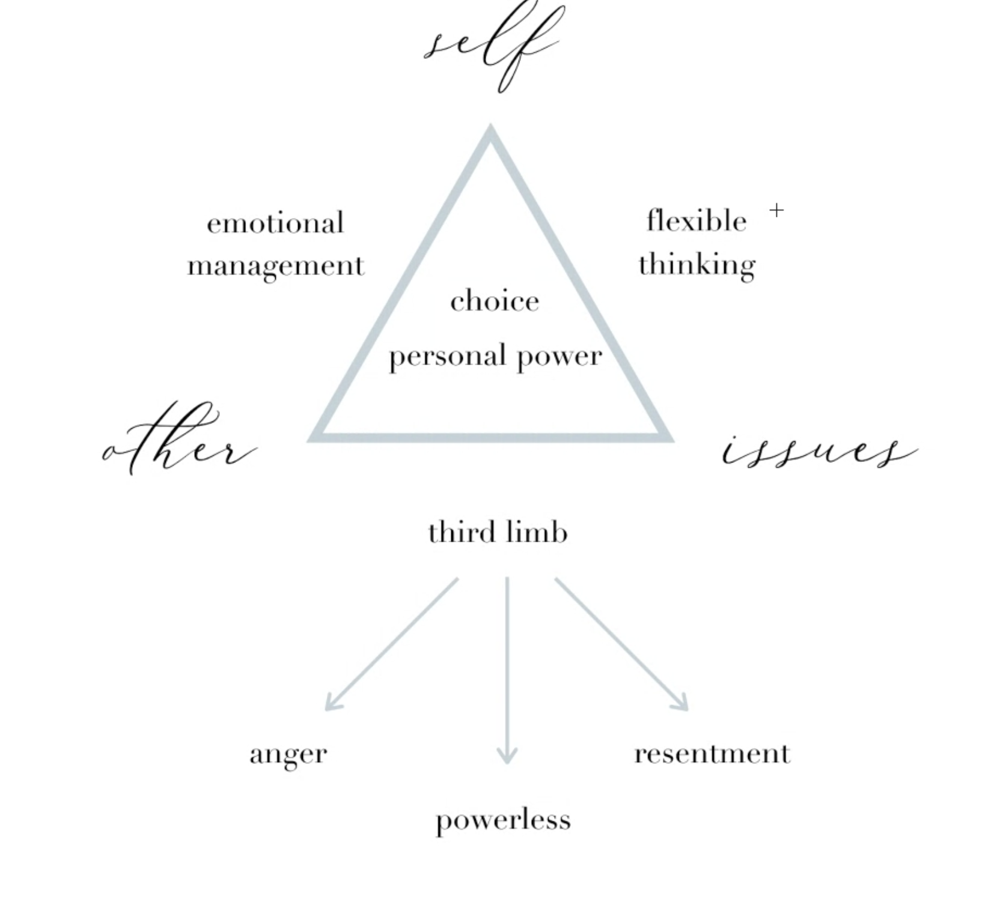

- Three laws of change
	- If I want to see change, I need to change
	- When I change, the other will change (although I have no control of what that change will look like)
	- In order for the change to occur, I need to stay connected
	- 
	- [[Dropbox Paper Files]]
	-