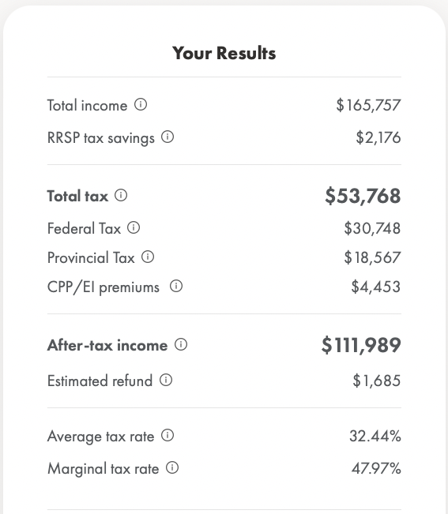
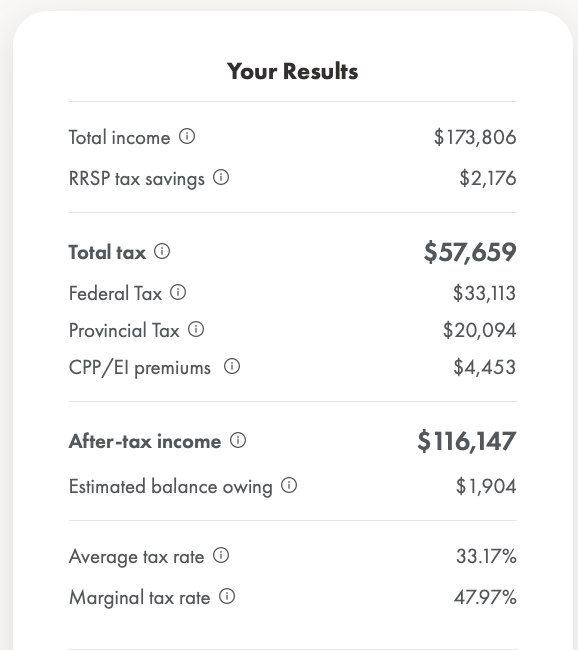

- Best case (Refund $1,685)
  collapsed:: true
	- 
- Worst case (Owing $1,904)
  collapsed:: true
	- 
- RRSP contributions by end of February 2023 (approx 4,750)
- Min extra contribution of 2,250 to reduce tax owed to under $700 (for worst case)
- Extra contribution of 3,700 to reduce tax owed to $0 (for worst case)
- Calculations
	- Gross pay: 160,806.42
	- RRSP Group: 7,400
	- Gross Pay - RRSP Group: 153,406.42
	- RRSP Personal: 4,750
	- Additional Income: 13,000
	- Taxable benefits: 9,235.06
	- Taxes paid: 51,303.42